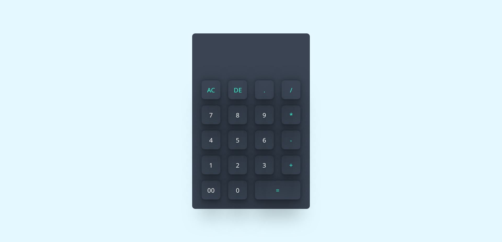

  

# Simple HTML Calculator

This is a simple calculator web application built using HTML, CSS, and JavaScript.

## 🌐 Live Demo

Check out the live demo [here](https://anajananashvili7.github.io/Calculator/).

## Features

- Basic arithmetic operations: addition, subtraction, multiplication, and division.
- Decimal point functionality.
- Clear button to clear the input.
- Delete button to remove the last entered character.
- Evaluation of expressions using the `eval()` function.

## Usage

1. Clone the repository to your local machine.
2. Open the `index.html` file in your preferred web browser.
3. Use the buttons to input numbers and perform calculations.
4. Press the "AC" button to clear the input.
5. Press the "DE" button to delete the last entered character.
6. Press the "=" button to evaluate the expression.

## 👩‍💻 Author

This calculator was created by **Ana Jananashvili**.

Connect with Ana on &nbsp;&nbsp;

## 🖼️ Screenshots

## 📜 License

This project is released under the [MIT License](LICENSE). You're free to use, modify, and distribute the designs as per the terms of the license.
